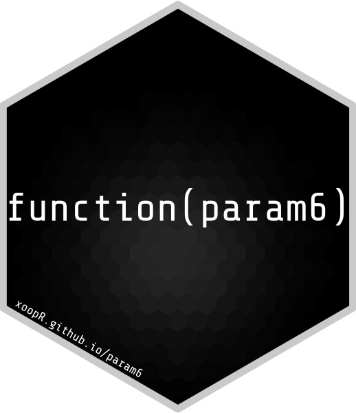

```{r setup, include=FALSE}
knitr::opts_chunk$set(echo = TRUE)
library(param6)
```



[](https://cran.r-project.org/package=param6)
[](https://cran.r-project.org/web/checks/check_results_param6.html)
[](https://github.com/xoopR/param6/actions/workflows/r-cmd-check.yml)

[](https://github.com/xoopR/param6)
[](https://github.com/xoopR/param6)

[](https://cran.r-project.org/package=param6)
[](https://codecov.io/gh/xoopR/param6)
[](https://CRAN.R-project.org/package=param6)
[](https://opensource.org/licenses/MIT)

## What is param6?

**param6** is an R6 parameter set interface for storing multiple parameters that may be used in other R6 (or other paradigm) objects. Key use-cases for R6 parameter sets have been seen in packages such as:

1. **[distr6](https://github.com/alan-turing-institute/distr6)** - In which R6 distribution objects require parameter sets in order to parametrise a given probability distribution. Parameters as objects allows efficient getting and setting of parameters, as well as composition of distributions.
2. **[mlr3](https://github.com/mlr-org/mlr3)** - In which R6 learners require parameter sets for passing parameters to machine learning models. Storing parameter set objects allows efficient tuning over these parameters.

## Main Features

Some main features/key use-cases of **param6** includes:

* Construction of parameter sets

```{r construction}
prms <- list(
  prm(id = "a", support = "reals", value = 1),
  prm(id = "b", support = "naturals")
)
ParameterSet$new(prms)
```

* Tagging parameters with properties

```{r tags}
prms <- list(
  prm(id = "a", support = "reals", value = 1, tags = "t1"),
  prm(id = "b", support = "nnaturals", tags = "t2")
)
ParameterSet$new(prms,
                 list(required = "t1", unique = "t2"))
```

* Getting and setting parameter values

```{r values}
prms <- list(
  prm(id = "a", support = "reals", value = 1, tags = "t1"),
  prm(id = "b", support = "naturals", tags = "t2")
)
p <- ParameterSet$new(prms)
p$values$b <- 2
p$values
p$get_values(tags = "t1", simplify = FALSE)
```

* Transform parameters

```{r trafo}
p <- ParameterSet$new(
  list(prm(id = "a", support = "naturals", value = 4))
)
p$trafo <- function(x, self) {
  x$a <- 2^x$a
  x
}
p$get_values("a", simplify = FALSE)
```

* Parameter dependencies

```{r deps, error=TRUE}
p <- ParameterSet$new(list(
  prm(id = "a", support = "naturals"),
  prm(id = "b", support = "naturals")
))
p$add_dep("a", "b", cnd("eq", 4))
p$values$b <- 5
p$values$a <- 1 # fails as b != 4
p$values$b <- 4
p$values$a <- 1 # now works
p$get_values()
```

## Why param6?

**param6** began as the [ParameterSet](https://github.com/alan-turing-institute/distr6/blob/main/R/ParameterSet.R) object in [distr6](https://github.com/alan-turing-institute/distr6). However this initial attempt at an R6 parameter set interface, had massive bottlenecks that were causing substantial problems in dependencies. **param6** is an abstracted parameter set interface that draws influence from this initial design, as well as [paradox](https://github.com/mlr-org/paradox) and [mcstate](https://github.com/mrc-ide/mcstate/). **param6** achieves faster run-times and smaller object-sizes than **distr6** and **paradox** by making the following design decisions:

* `data.table` objects are minimised and only used when absolutely necessary, instead `list` objects are utilised.
* Symbolic representation of sets is utilised via the [set6](https://github.com/xoopR/set6/) package in order to store sets as characters, thereby reducing object sizes. Additionally, **param6** includes a [support_dictionary](https://github.com/xoopR/param6/blob/main/R/support_dictionary.R) which stores constructed sets that can then be accessed via a string representation, thereby preventing the same set needing to be constructed multiple times.
* [Rcpp](https://github.com/RcppCore/Rcpp) is utilised via **set6** in order to allow very fast containedness checks when checking values lie within a parameter support.
* S3 is embraced for simple objects, such as the [prm](https://github.com/xoopR/param6/blob/main/R/prm.R) object in order to increase speed in construction times.
* Parameters are grouped internally by their supports, and not individually, allowing for a further increase in efficiency of both storage and runtimes in containedness checks
* The notion of 'parameter set collections' is removed in favour of automated methods for setting and getting prefixes in parameter IDs

## Installation

For the latest release on CRAN, install with
```{r eval=FALSE}
install.packages("param6")
```

Otherwise for the latest stable build
```{r eval=FALSE}
remotes::install_github("xoopR/param6")
```

## Future Plans

The **param6** API is still experimental and may be subject to major changes.
To understand if **param6** fulfills it's initial use-case correctly, the next step will be to incorporate the package in **distr6**, which may involve minor or major changes to the current API. From there, Rcpp will be embraced more fully in **set6** and then in **param6** to improve package speed.

## Package Development and Contributing

**param6** is released under the [MIT licence](https://opensource.org/licenses/MIT). We welcome and appreciate all [new issues](https://github.com/xoopR/param6/issues) relating to bug reports, questions and suggestions. You can also [start a discussion](https://github.com/xoopR/param6/discussions) for more extensive feedback or feature suggestion.
